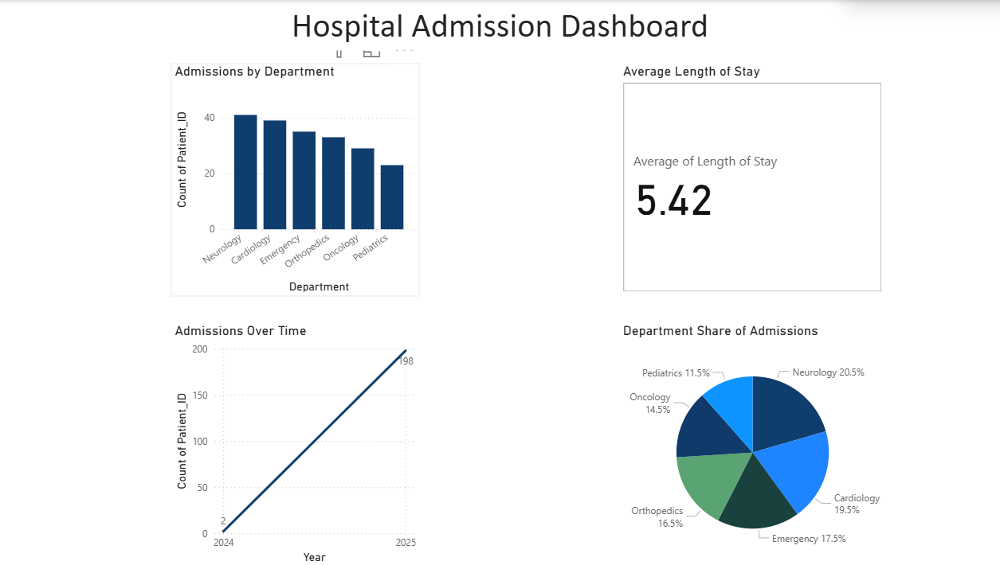

# Hospital Admission Dashboard 🏥

This Power BI project analyzes hospital patient admissions by department and over time.  
It highlights average length of stay and visualizes trends for improved healthcare insights.

## 🔧 Tools Used
- Power BI
- Excel
- SQL

## 📊 Visuals Included
- Bar Chart: Admissions by Department
- Line Chart: Monthly Admission Trends
- Pie Chart: Department Share
- Card KPI: Avg Length of Stay

## 📸 Screenshot

## 📁 Download Project File
[Hospital_Admission_Dashboard.pbix](Hospital_Admission_Dashboard.pbix)

